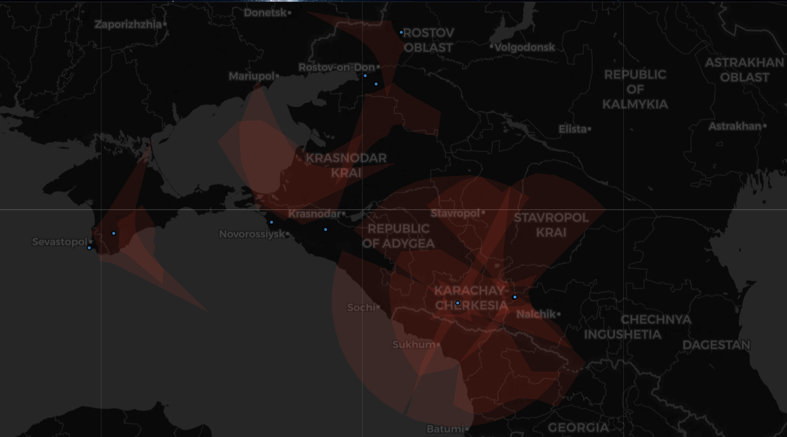
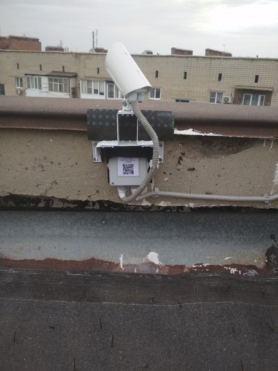
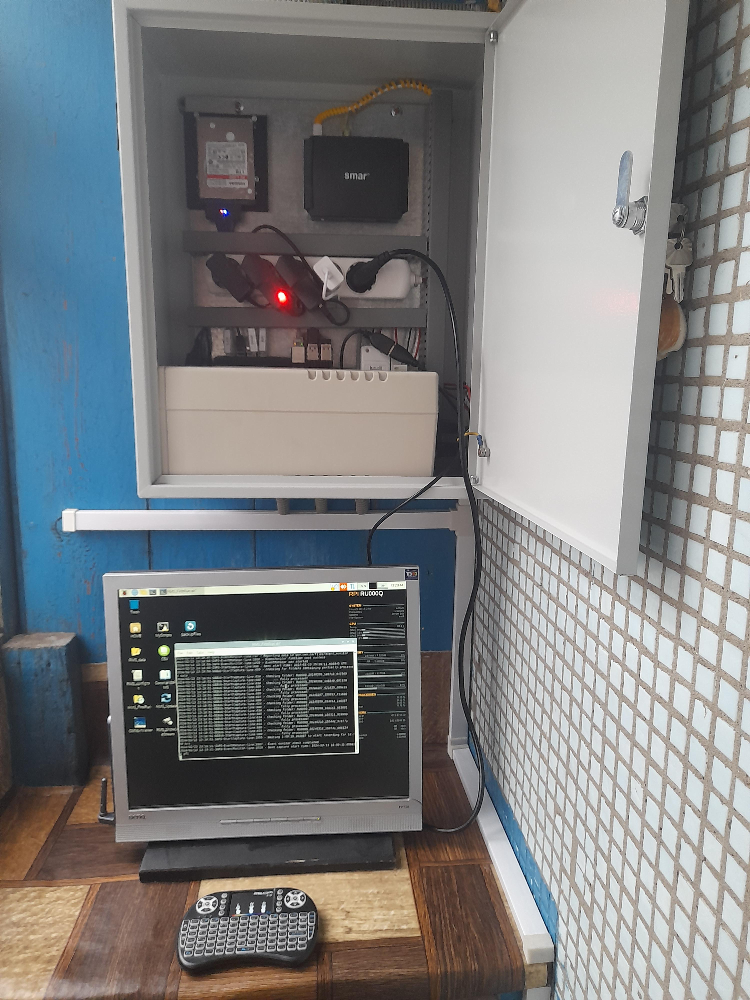
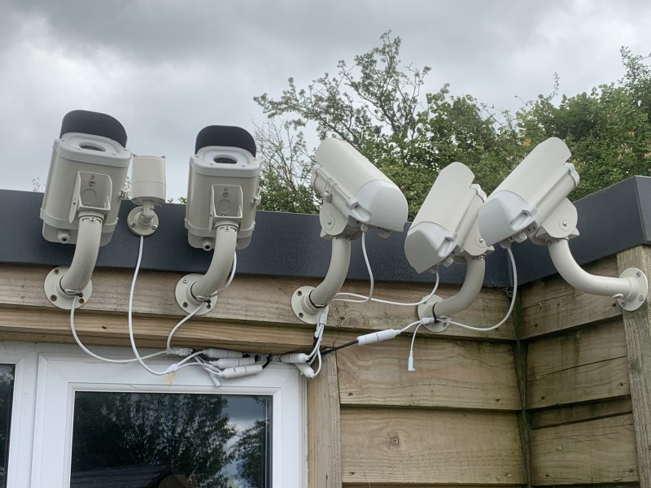
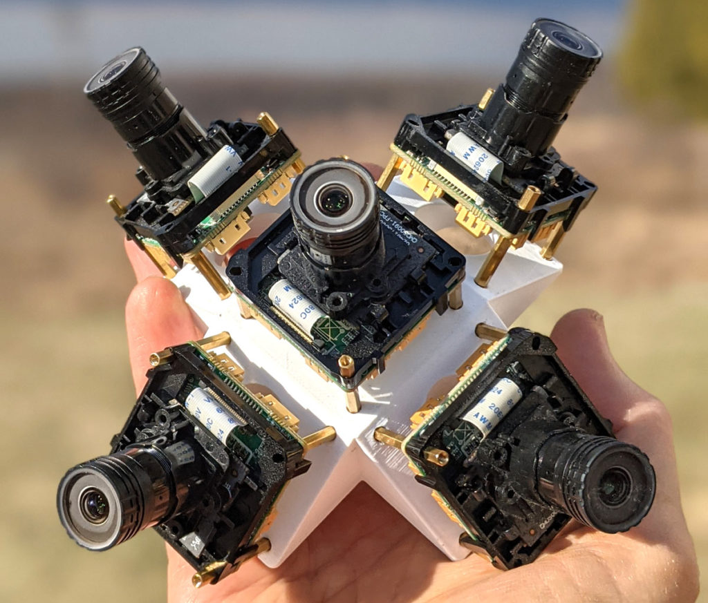
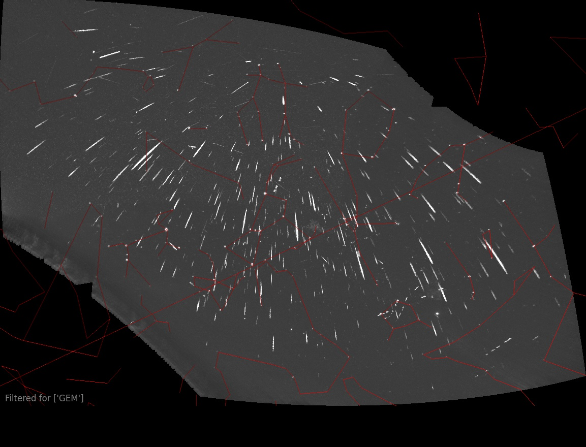
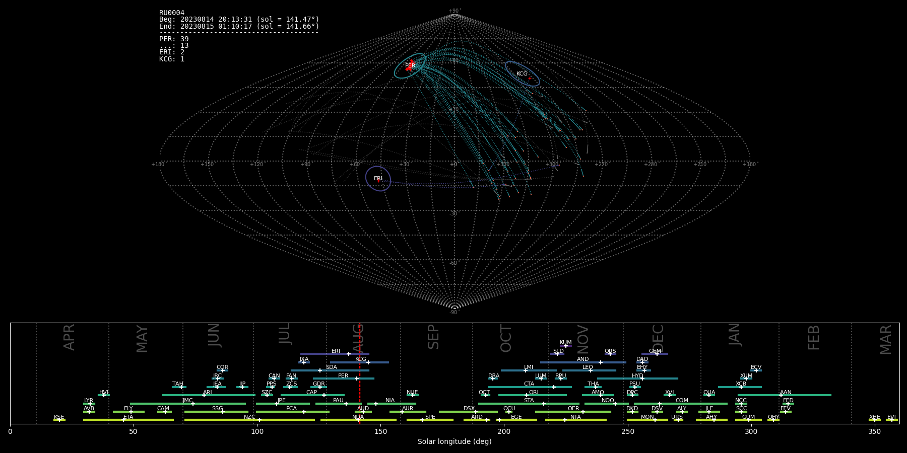
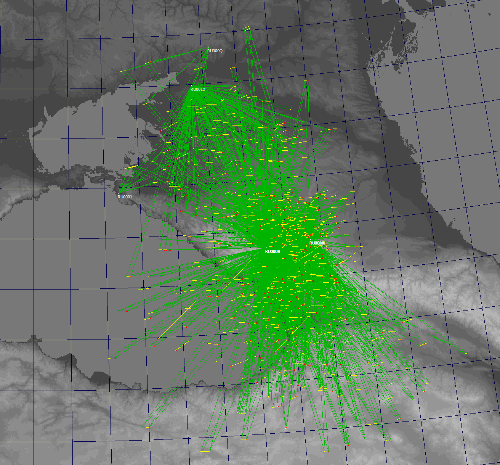

# Южно-российская метеорная сеть (SRMN)
Южно-российская метеорная сеть (**SRMN**) является частью глобальной метеорной сети - [**GMN**](https://globalmeteornetwork.org/wiki/index.php?title=Main_Page).  

В настоящее время южно-российский сегмент состоит из 14 станций:  
Станция **RU0001** в станице Анапская, Краснодарский край;  
Станции **RU0003, RU0004, RU0008, RU0009, RU000E, RU000F** на астроферме "Астроверты";  
Станции **RU000M, RU000N, RU0016, RU0017, RU0018** в ГАО ГАС;  
Станция **RU000Q** в городе Шахты, Ростовская область;  
Станция **RU0019** в хуторе Кочеванчик, Ростовская область;  

  

## Описание станции
Каждая станция состоит из одноплатного компьютера **Raspberry Pi** и серийной **IP**-камеры видеонаблюдения.  

Программное обеспечение станции - **RMS** (**Raspberry Meteor Station**) работает в операционной системе **Linux** (**Raspbian**).  
Имеется возможность установки **RMS** в ОС **Ubuntu 20.04 LTS** с [поддержкой нескольких камер](https://globalmeteornetwork.org/wiki/index.php?title=Advanced_RMS_installations_and_Multi-camera_support).  

  
  

## Программное обеспечение **RMS**
Программное обеспечение [**RMS**](https://github.com/CroatianMeteorNetwork) рассчитывает интервал съёмки от заката до восхода солнца. В зависимости от модели камеры и возможностей **RPi**, камера снимает 25 или более кадров в секунду в период между вечерними и утренними сумерками.  
Во время непрерывной съёмки изображений станция начинает обрабатывать полученные данные, выполняя предварительный отбор кадров с подходящим количеством звёзд (обычно около 20), что делает целесообразным дальнейший поиск метеоров.  
После завершения сбора данных станция переключается на обработку всех отобранных кадров, а затем уточняет астрометрическую точность каждого положительного обнаружения. После анализа каждого обнаружения создаются файлы сводки.  
Эти файлы включают в себя текстовое представление данных в нескольких общепринятых форматах (**CAMS** и **UFOorbit**), графики, набор миниатюр, стеки, **flat**-файл для коррекции изображений и карту с указанием всех идентифицированных радиантов, таймлапс в формате **mp4**, демонстрирующий покадровую съёмку всех полученных за ночь изображений. Вся графическая информация загружается [на статусный сайт **GMN**](https://globalmeteornetwork.org/weblog/RU/index.html). С помощью встроенных инструментов **RMS** пользователь может обрабатывать данные, собранные за ночь наблюдений.  

Все результаты объединяются в один архив, который автоматически загружается на центральный сервер **GMN**.  
Открытое программное обеспечение метеорных станций позволяет пользователю RMS добавлять свои функции.  
Это позволило написать дополнительные скрипты для станций южно-российского сегмента, предназначенные для загрузки "сырых" данных станций в общедоступные источники.  

## Публикация данных
Обратившись в группу ["Метеоры и болиды"](https://vk.com/meteors_ru), вы можете получить доступ к облачным хранилищам **csv**-файлов для просмотра в программе [**UFOOrbit**](https://sonotaco.com/soft/e_index.html).  
Данные доступны в хранилищах:  
- Яндекс-Диск;  
- **Dropbox.**  

На всех станциях южно-российского сегмента настроен автоматический экспорт **csv**-файлов в указанные ранее облачные хранилища. Данные обновляются ежедневно.  
Желающие могут запросить ссылки на скачивание данных из облака для просмотра и анализа.

Обратившись с соответствующим запросом в группу ["Метеоры и болиды"](https://vk.com/meteors_ru) вы можете получить доступ к хранилищу архивов метеорных станций Южно-российского сегмента **GMN**.  
Хранилище содержит архивы станций за год работы и данные по болидам, зафиксированным сетью с 2024 года.  

## Интеграция с проектом Starvisor
[Ильёй Янковским](https://vk.com/jankowsky) создан проект онлайн-мониторинга звёздного неба - [**Starvisor**](https://starvisor.ru/meteor/). Программное дополнение станций **SRMN** настроено на загрузку изображений всех станций на сайт проекта в режиме **on-line**.  

## Присоединиться к проекту RMS
Для пользователей системы **RMS** было составлено [руководство по сборке и настройке станции](https://disk.yandex.ru/d/kr1lVkyqDzQY-Q) и [по установке дополнительных скриптов](https://disk.yandex.ru/d/kr1lVkyqDzQY-Q). Вы можете воспользоваться этими материалами чтобы присоединиться к проекту.  
Также необходимо ознакомиться с [материалами проекта **GMN RMS**](https://globalmeteornetwork.org/wiki/index.php?title=Main_Page), которые часто обновляются.  
Проявив должное усердие, вы сможете получить в своё распоряжение многофункциональный научный инструмент. Станция **RMS** может служить хорошим подспорьем к изучению **ОС Linux** на начальном этапе, что может использоваться в образовательных целях.  
В заключение привожу все доступные ссылки по данной тематике.

## CСЫЛКИ
### ИНТЕРНЕТ-РЕСУРСЫ GMN
1. [Официальный сайт](https://globalmeteornetwork.org/?topic=ufoorbit-support);
2. [Wiki](https://globalmeteornetwork.org/wiki/index.php?title=Main_Page);
3. [Исходный код](https://github.com/CroatianMeteorNetwork);
4. [YouTube-канал](https://www.youtube.com/@globalmeteornetwork8382);
5. [Форум GMN](https://globalmeteornetwork.groups.io/).

### ССЫЛКИ НА ДАННЫЕ GMN
1. Статусные сайты:
- [GMN camera status page for Russian Federation](https://globalmeteornetwork.org/weblog/RU/index.html);
- [GMN RU Latest Status](https://globalmeteornetwork.org/status/);
2. Карты:
- [GMN Meteor Map](https://www.meteorview.net/map3);
- [Meteor map](https://tammojan.github.io/meteormap/);
3. Данные RMS:
- [Meteor Shower Flux Monitoring](https://globalmeteornetwork.org/flux/);
- [Radiants and data](https://globalmeteornetwork.org/data/);
4. Обработка данных:
- [Access our Data - GMN Data Explorer](https://explore.globalmeteornetwork.org/);
- [gmn-python-api](https://gmn-python-api.readthedocs.io/en/latest/);
